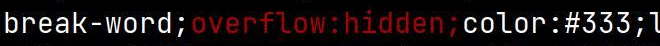

Dartbook is a dart implementation of gitbook-cli for guys who loves gitbook.


### Installation

* Requirement: [Dart](https://dart.dev/get-dart) sdk >= 3.0

`dartbook` should be "activated".

```
$ dart pub global activate dartbook
$ export PATH=$PATH:~/.pub-cache/bin
```

### Create a book

set up a boilerplate book:
```sh
$ dartbook init
```

Preview and serve your book using:
```sh
$ dartbook serve
```

Build the static website using:
```sh
$ dartbook build
```

Show what have changed in one document:
```sh
$ dartbook diff [file1] [file2] ...
```

Nearly same with gitbook!

### Feature

* Write using Markdown
* Patch diff of characters
* Output as a website or ebook (pdf, epub, mobi)
* Multi-Languages
* Lexicon / Glossary
* Variables and Templating
* Content References
* Material default theme

### Why

Dartbook aims to smooth the migration from GitBook (Legacy) to Dart.

[gitbook-cli](https://github.com/GitbookIO/gitbook) stopped developping since 5 years ago, it was used widely but with many shortage.

First, it is very slow, especially for those books containing over 100 pages, in my case, it cost over 5 minutes for my project, which contains 3 language books, 168 pages for each.

Second, it contains some issues, e.g. glossary matching in different lingual text.

There is a nodejs project forked of gitbook called [honkit](https://github.com/honkit/honkit), but it inherits bugs and errors since gitbook, and its update and bug-fixing is not so active.

### What

Try to keep everything same with gitbook, dartbook is compatible to run existing book projects. A little differences are:

1. No glossary generated page. All glossary entries are shown as tooltip, no more link jumping.

2. Encoding text as slug id. In different lingual text, many glossories contain special characters.

3. No mulilingual book any more in code, every book is managed by `BookContext`. `langPath` of `Book` is `''` if book is located in project root.

4. Book navigation would ignore invalid link article.

5. No more font-sizing, theme-changing settings config, but they would come back in the future if new UX design appears.

### Extension

Using dartbook, it is easy to custom your book website, just create 'theme' in book project's root directory, and create '_layouts' for your book's pages' layout, '_i18n' for different i18n string resources and '_assets' for appearance. It keeps same with gitbook's style.

### Theme development

Dartbook's theme based on [materialize](https://github.com/materializecss/materialize/) css framework. If you would like to custom your own theme style, just did as follow steps:

  1. Download latest materialize source package, e.g. [materialize-src-v1.2.0.zip](https://github.com/materializecss/materialize/releases/download/1.2.0/materialize-src-v1.2.0.zip). Extract it and move its sass directory to `$dartbookRoot/theme/web`. We need materialize's components to build our own styles.
  2. Install dart sass command line tool: `dart pub global activate webdev sass`, of course, make sure your envrionment variables include `~/.pub-cache/bin`: `export PATH=$PATH:~/.pub-cache/bin`.
  3. `cd $dartbookRoot/theme && sass web/styles.scss web/styles.css`, and then run `webdev serve`.
  4. Open `http://127.0.0.1:8080` in your browser, and start to modify something.
  5. `git clone https://github.com/lindeer/dartbook-theme-default` and export its path as `$assetRoot`.
  6. `main.dart` would finally compile to `dartbook.js`, its main functionality is to show glossary tooltips and bind events for them. `materialize.js` is entirely copied as dartbook's assets. `build.sh` is a helper script for file copy and rename, run it when you finally finished theme developing. The final material　produced by web (`theme/build/*.css,*.js`) would be applied into dartbook resources (`$assetRoot/_assets`).
  7. In the directory `$assetRoot`, commit your changes and change the package name to `dartbook_theme_xxx`, what ever you like. Do not forget to change the theme name of ci files in your **book project**:
```diff
-  - dart pub global activate dartbook_theme_default
+  - dart pub global activate dartbook_theme_xxx
```

### Patch diff

Git diff is based on line, that means whole line would be labeled even if one character is changed, it is extremely inconvenient to find what we haved revised when doing authoring work. Thanks to [google-diff-match-patch](https://github.com/google/diff-match-patch), we could clearly take on the text change.

Just change command `git diff [<options>]` to `dartbook diff [<options>]`, it would output precisely the revised character.




### plugins system

It is very powerful to use plugins to extend applications, but currently we had no plan for it.
